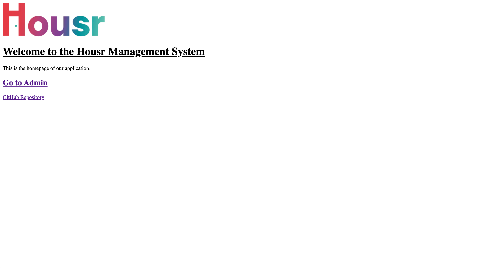
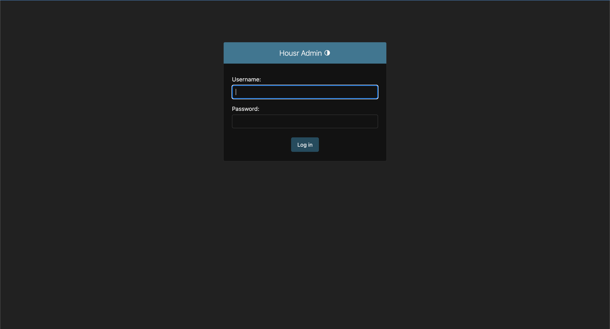
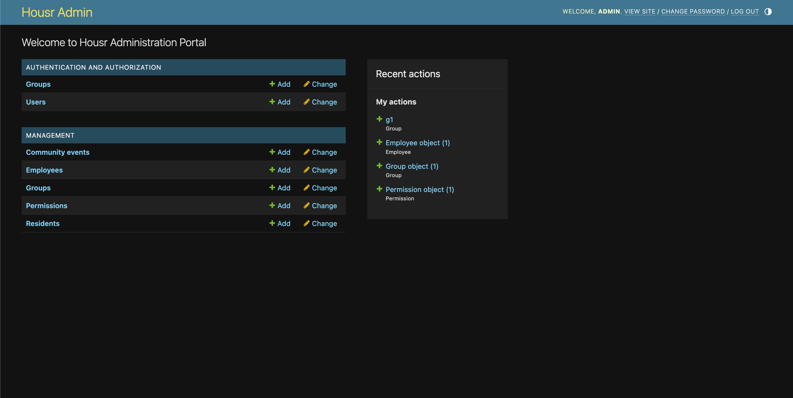
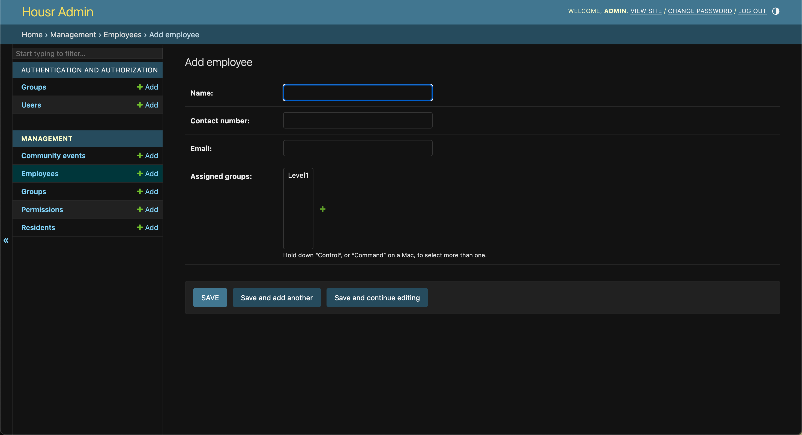
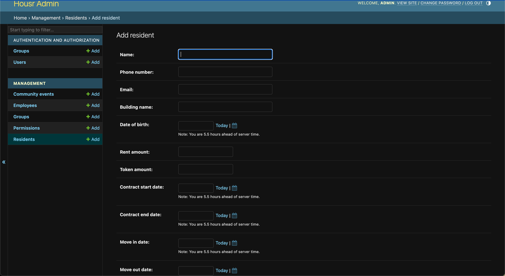
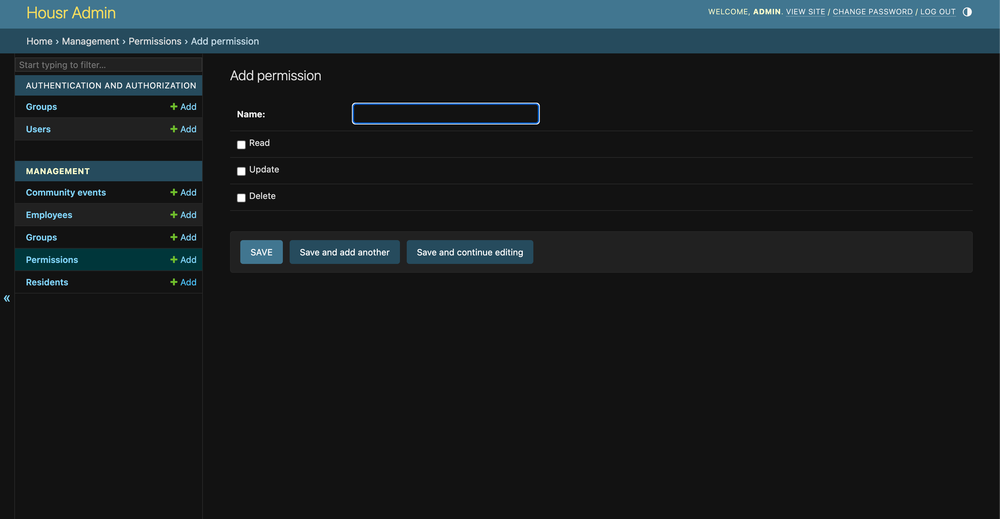
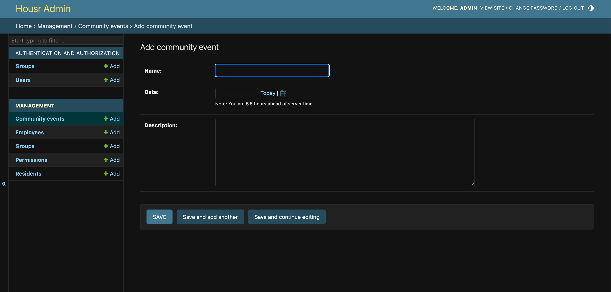

 # Community Management System

The Community Management System is a web application designed to help manage community residents, employees, events, and permissions. It provides a user-friendly interface for administrators to manage different aspects of the community.

## Features

- Manage residents' information, contracts, and move-in/move-out dates.
- Assign groups and permissions to employees for role-based access control.
- Organize and schedule community events.
- Integration with the Django Admin panel for easy management.

## Getting Started

### Prerequisites

- Python 3.10
- Django (version 4.2.4)

### Run Project At:
[Housr Management](http://yagyansh.pythonanywhere.com/)

## Screenshots
### Homepage

### Admin

### Dashboard Panels

